# Clan Case Study — End-to-End Data & Analytics Pipeline

This repository contains a two-part case study demonstrating an end-to-end data engineering and analytics workflow, from API ingestion and cloud deployment to analytical modeling and dashboarding.

---

## High-Level Architecture

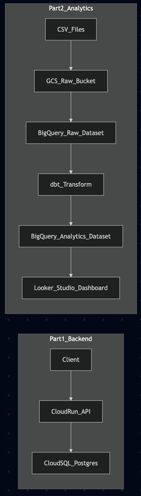

**Part 1 — Data Ingestion & Backend**

- FastAPI service for ingesting user activity data
- PostgreSQL (Cloud SQL) for persistent storage
- Containerized with Docker
- Deployed on Google Cloud Run

**Part 2 — Analytics & BI**

- Raw data loaded into BigQuery
- dbt used for analytical modeling
- Separation of `raw` and `analytics` datasets
- Looker Studio dashboard for visualization

---

## Part 1 — Backend, Storage & Cloud Deployment

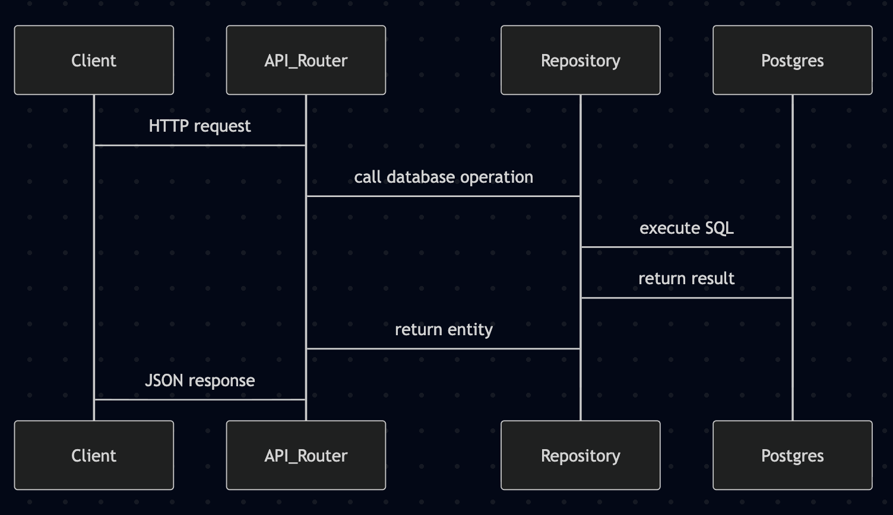

### Overview

Part 1 focuses on building a small ingestion API and running it as a containerized service, locally with Docker Compose and remotely on Google Cloud Run.

I implemented:

- A FastAPI application for the ingestion endpoints
- A PostgreSQL database (Cloud SQL) as the source of truth
- Idempotent writes to prevent duplicate data
- Dockerized local and cloud execution
- Cloud Run for serverless deployment

---

### Local Development

### Run with Docker Compose

```bash
docker compose up --build
```

This starts:

- FastAPI service
- PostgreSQL database

The API becomes available at:

```
http://localhost:8080
```

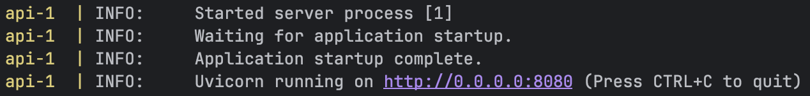

### Run without Docker (local dev)

```bash
uvicorn app.main:app --reload
```

### Database Seeding

The database can be seeded with initial clan data from the provided CSV.

Docker (local development):

```
docker compose up --build -d
```
```
docker compose exec api python -m app.scripts.seed_clans_from_csv
```

Notes:
- Seeding is idempotent
- The seeding script checks for an existing clan by name before insertion
  - Re-running the script does not create duplicates
---

### Database Access

- PostgreSQL data can be inspected using **DBeaver**
- This allows direct verification of ingested data

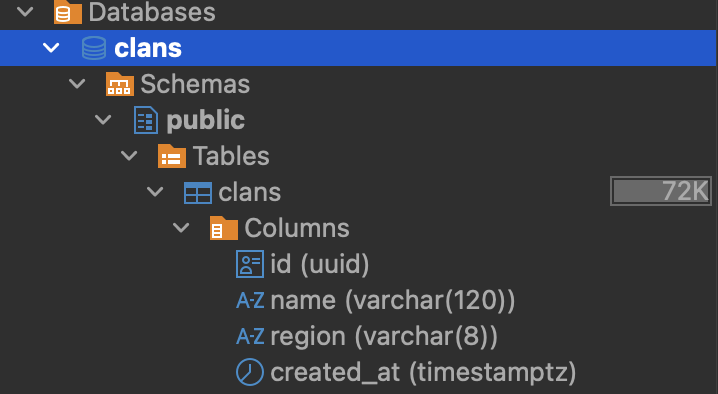

---

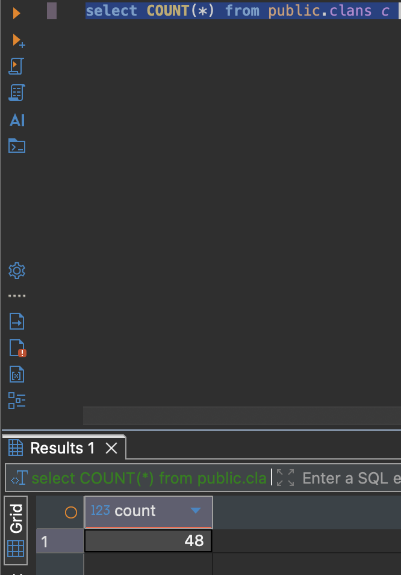

### Cloud Deployment

### Cloud SQL

- Managed PostgreSQL instance
- Stores ingested user-level data
- Stores clan data persistently

### Cloud Run

- FastAPI app deployed as a container
- Automatically scales based on traffic
- Connects securely to Cloud SQL

Deployment flow:

1. Build Docker image
2. Push to container registry
3. Deploy to Cloud Run
4. Cloud Run connects to Cloud SQL

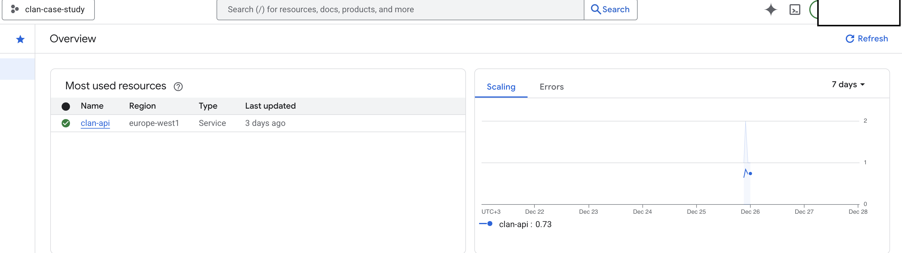

---

## API Endpoints:

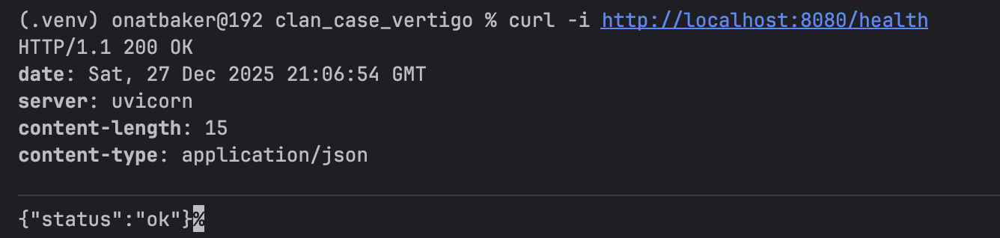

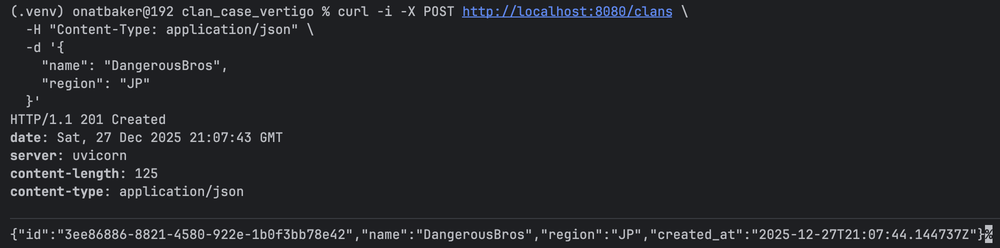

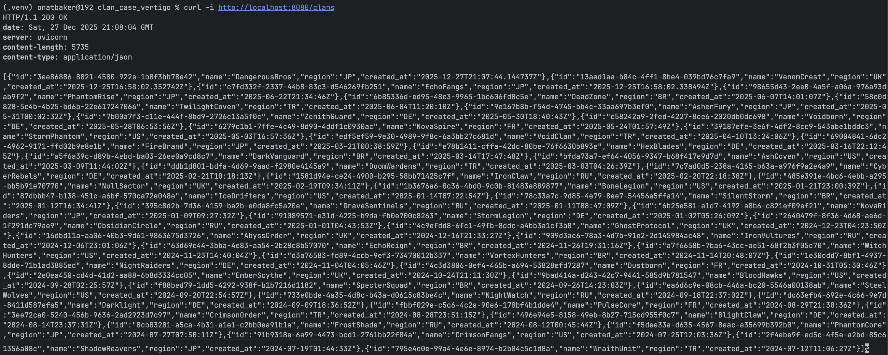

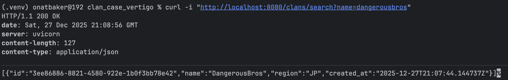

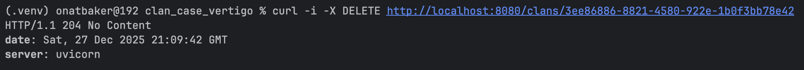

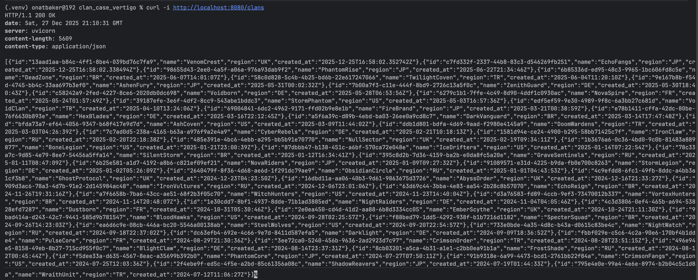

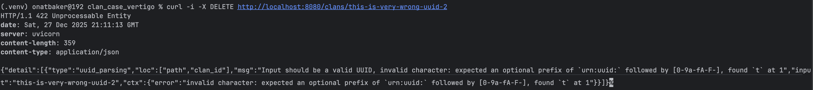

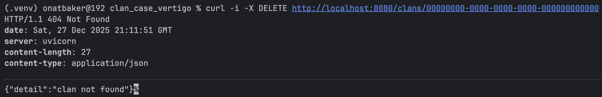

## Part 2 — Analytics, dbt & Visualization

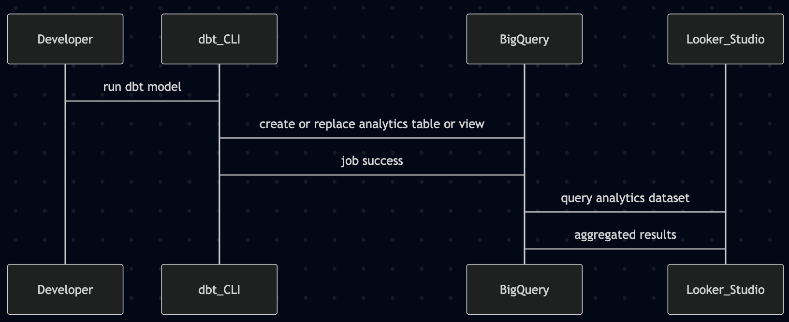

### Overview

Part 2 focuses on **analytics engineering**:

- Transforming raw data into business-ready metrics
- Using dbt and BigQuery
- Building an interactive BI dashboard

---

### Project Structure

The project is split into two top-level directories:

```
clan_case_vertigo/
├── api/
├── part2_analytics/
│   └── clan_case_dbt/
```

The backend API and analytics parts are kept separate to avoid mixing.

---

### BigQuery Setup

Two datasets were created:

- `clan_case_raw`
    
    Contains raw, ingested data
    
- `clan_case_analytics`
    
    Contains transformed, aggregated models
    
    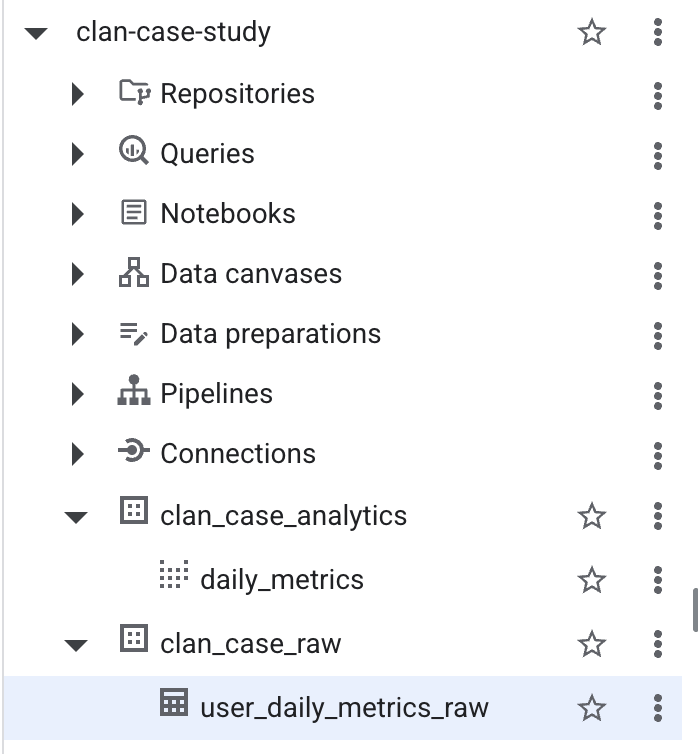
    

---

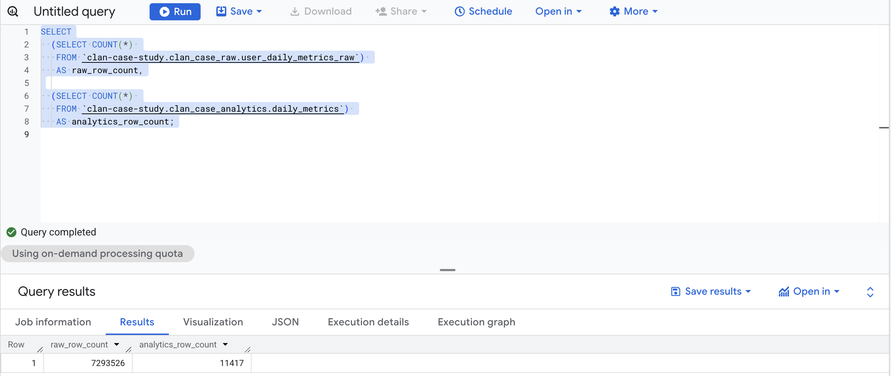

### Raw Data

Raw user-daily metrics were loaded into BigQuery:

- ~**7.3 million rows**
- One row per user per day
- Validated using BigQuery CLI:

```bash
bq query --location=EU --use_legacy_sql=false \
"SELECT COUNT(*) FROM clan_case_raw.user_daily_metrics_raw"
```

---

### dbt Initialization & Configuration

dbt was initialized inside `part2_analytics`:

```bash
dbt init clan_case_dbt
```

We configured dbt to:

- Use BigQuery as the warehouse
- Authenticate via GCP OAuth
- Write models to `clan_case_analytics`

Connection validated with:

```bash
dbt debug
```

---

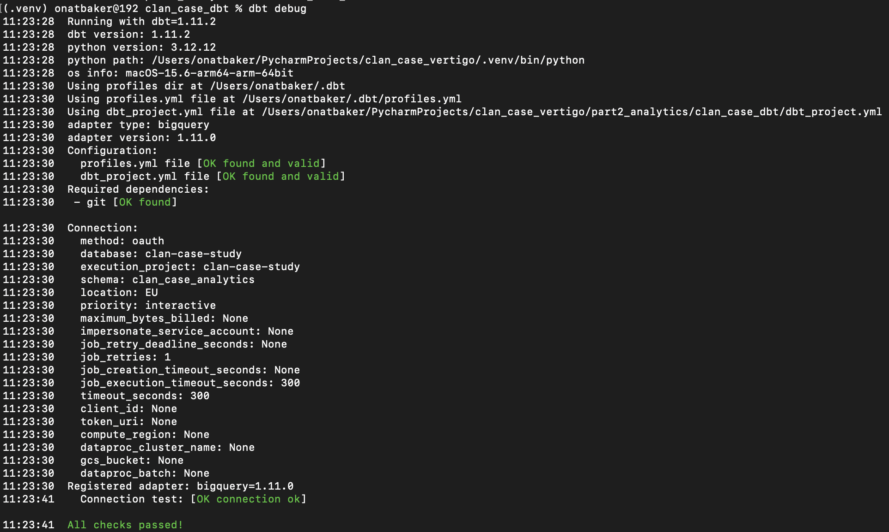

### Analytical Modeling

Using dbt, a single analytical model (`daily_metrics`) was created to aggregate raw event data into daily metrics.

The model computes:

- Daily Active Users (DAU)
- Total IAP revenue
- Total ad revenue
- ARPDAU (derived from daily aggregates)
- Match counts per DAU
- Server error ratio per DAU

Example:

- **Raw dataset**: ~7.3M rows
- **Analytics dataset**: ~11.4K rows aggregated
    
    (daily × country × platform)
    

Models were built with:

```bash
dbt run
```

---

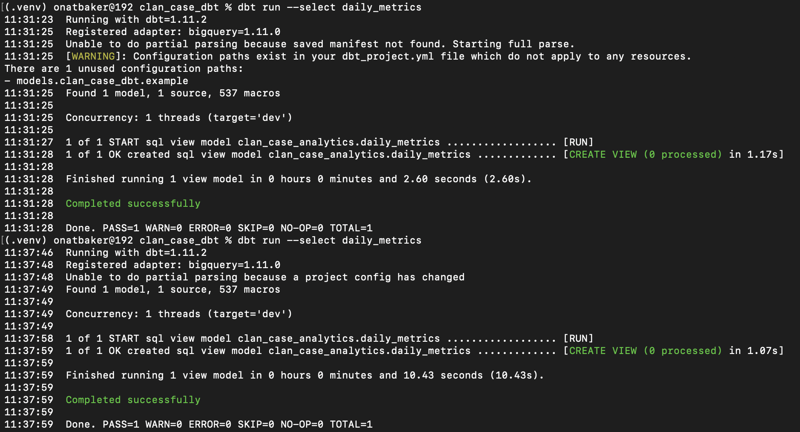

### Validation Queries

We validated analytics output via CLI:

```bash
bq query --location=EU --use_legacy_sql=false \
"SELECT COUNT(*) FROM clan_case_analytics.daily_metrics"
```

We also verified dimensional consistency:

- Same number of days
- Same countries
- Same platforms

---

## Dashboarding with Looker Studio

### Setup

- Looker Studio connected directly to BigQuery
- Source: `clan_case_analytics.daily_metrics`
- No data duplication

### Dashboard Features

- KPI scorecards:
    - Total DAU (selected period)
    - Total IAP revenue
    - Total ad revenue
    - Weighted ARPDAU
- Time-series DAU trend
- DAU by platform
- Top countries performance table
- Interactive filters:
    - Date range
    - Platform
    - Country

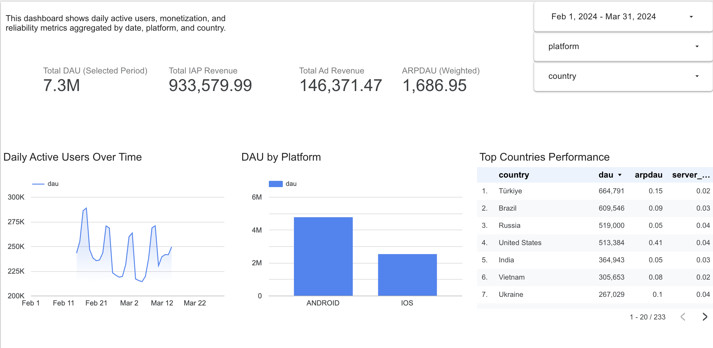

---

---

## Tools & Technologies

- **FastAPI**
- **PostgreSQL (Cloud SQL)**
- **Docker & Docker Compose**
- **Google Cloud Run**
- **BigQuery**
- **dbt**
- **Looker Studio**
- **DBeaver**
- **GCP CLI & BigQuery CLI**

---

## Notes

- The dashboard is built on aggregated analytics tables, not raw data
- All transformations are reproducible via dbt